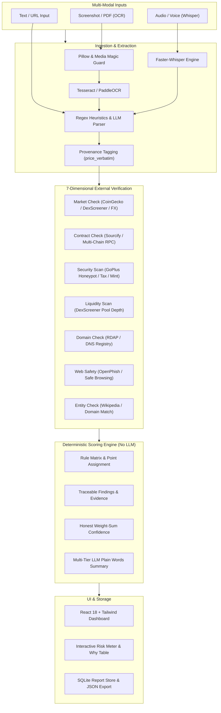

# OfferCheck: AI-Powered Multi-Modal Crypto Scam Verification & Risk Intelligence Platform

[](https://github.com/Barathraj009/OfferCheck)
[](https://opensource.org/licenses/MIT)
[](https://www.python.org/)
[](https://fastapi.tiangolo.com/)
[](https://react.dev/)
[](https://www.typescriptlang.org/)
[](https://vitejs.dev/)
[](https://tailwindcss.com/)

> **OfferCheck** is a full-stack, multi-modal risk assessment platform designed to help everyday crypto users **verify any investment, token, airdrop, or peer-to-peer cryptocurrency offer before sending money or connecting wallets**.

---

## 📌 Direct Links & Repository Structure

* **Main Repository:** [https://github.com/Barathraj009/OfferCheck](https://github.com/Barathraj009/OfferCheck)
* **Backend Source:** [`backend/`](https://github.com/Barathraj009/OfferCheck/tree/main/backend)
  * [Scoring & Deterministic Rules](https://github.com/Barathraj009/OfferCheck/blob/main/backend/app/scoring.py)
  * [Multi-Tier LLM Chain](https://github.com/Barathraj009/OfferCheck/blob/main/backend/app/llm.py)
  * [Regex & Heuristic Claim Extraction](https://github.com/Barathraj009/OfferCheck/blob/main/backend/app/extraction.py)
  * [Faster-Whisper Audio Transcription](https://github.com/Barathraj009/OfferCheck/blob/main/backend/app/whisper_routes.py)
  * [PaddleOCR & Tesseract Engine](https://github.com/Barathraj009/OfferCheck/blob/main/backend/app/ocr.py)
  * [Verification Sources & Adapters](https://github.com/Barathraj009/OfferCheck/tree/main/backend/app/sources)
  * [SSRF & Security Defense](https://github.com/Barathraj009/OfferCheck/blob/main/backend/app/sources/common.py)
  * [SQLite Report Store](https://github.com/Barathraj009/OfferCheck/blob/main/backend/app/store.py)
* **Frontend Source:** [`frontend/`](https://github.com/Barathraj009/OfferCheck/tree/main/frontend)
  * [Offer Verification Page](https://github.com/Barathraj009/OfferCheck/blob/main/frontend/src/pages/Check.tsx)
  * [Dynamic Risk & Explainability Report](https://github.com/Barathraj009/OfferCheck/blob/main/frontend/src/pages/Report.tsx)

---

## 🌟 Key Features

1. **Multi-Modal Input Ingestion:**
   - **Text & Links:** Analyzes descriptions, social media pitch copy, telegram pitches, and website URLs.
   - **Visual OCR (Screenshots & PDFs):** Dual-pipeline OCR powered by **Tesseract** & **PaddleOCR** with grayscale conversion, adaptive contrast enhancement, and orientation detection.
   - **Voice & Audio Notes:** Integrated with **faster-whisper** (`Systran/faster-whisper-tiny` with int8 quantization) and browser Web Speech API supporting 10+ regional languages (Hindi, Tamil, Telugu, etc.).

2. **Multi-Tier Robust LLM Extraction & Summary Fallback:**
   - Provider cascade: **Groq (`llama-3.3-70b-versatile`)** $\rightarrow$ **OpenRouter** $\rightarrow$ **Google Gemini (`gemini-flash-latest`, `gemini-3.8-flash`)** $\rightarrow$ **Local Offline Ollama (`llama3.2:1b`)** $\rightarrow$ **Deterministic Template**.
   - Strict prompt-injection sanitization and provenance tagging (`price_verbatim`).

3. **7-Dimensional Independent Verification Engine (Zero-Cost / Keyless):**
   - **Market Price & FX Check:** Real-time pricing via **CoinGecko**, **DexScreener**, and **Binance** with currency conversion through European Central Bank (Frankfurter FX).
   - **Smart Contract Verification:** Open-source code verification via **Sourcify v2** and public multi-chain RPC bytecodes (Ethereum, BSC, Polygon, Arbitrum, Base).
   - **Contract Security Scan:** Threat detection via **GoPlus Security API** (honeypot check, mintable status, hidden owners, excessive sell tax, balance drain functions).
   - **DEX Liquidity & Volume:** Liquidity pool depth and 24h volume tracking via **DexScreener**.
   - **Domain Registration Age:** RDAP / WHOIS registry age lookup with DNS fallback.
   - **Web Threat Intelligence:** Real-time URL phishing check against **OpenPhish** feeds and Google Safe Browsing.
   - **Entity & Brand Impersonation:** Cross-references company identity against Wikipedia and authoritative domain registries.

4. **Deterministic Rule Engine (No Hallucinations):**
   - **LLMs never compute or touch risk scores.**
   - All points originate from verified, deterministic rules in `scoring.py`.
   - Every point is traceable to explicit findings with observed values, difference percentages, and provider evidence.
   - Confidence score is mathematically computed strictly from verified check weights (sum of 20/20/10/20/10/10/10 = 100).

5. **Enterprise-Grade Security Hardening:**
   - **SSRF Protection:** Strict private IP blocklist (IPv4, IPv6, loopback, link-local, AWS metadata endpoints `169.254.169.254`), scheme enforcement (`https://` required), and DNS rebinding defense.
   - **Decompression Bomb Guard:** Pillow `MAX_IMAGE_PIXELS` enforcement on image uploads.
   - **Rate Limiting:** Sliding-window in-memory IP rate limiter with `429 Too Many Requests` and `Retry-After` headers.
   - **Magic Byte Validation:** Binary signature inspection for PNG, JPEG, WebP, and PDF uploads.

6. **Persistent SQLite Report Hub:**
   - Save reports locally with privacy-first SQLite store.
   - Shareable report URLs and one-click JSON export.

---

## 🏗️ System Architecture



---

## 🚀 Quickstart & Setup

### Prerequisites
- Python 3.11+
- Node.js 18+ and npm
- Tesseract OCR (Optional for local screenshot OCR: `winget install UB-Mannheim.TesseractOCR` or `apt install tesseract-ocr`)

### One-Click Windows Launcher
Double-click `start.bat` in the repository root or run:
```cmd
start.bat
```

### Manual Setup

#### 1. Backend Service
```bash
cd backend
python -m venv .venv

# Activate virtual environment
# Windows:
.venv\Scripts\activate
# Linux/macOS:
source .venv/bin/activate

pip install -r requirements.txt

# Start backend server
uvicorn app.main:app --host 127.0.0.1 --port 8000 --reload
```

#### 2. Frontend Application
```bash
cd frontend
npm install
npm run dev
```
Open [http://localhost:5173](http://localhost:5173) in your browser.

---

## ⚙️ Environment Configuration (`backend/.env`)

All keys are **optional**. The platform operates completely in **zero-cost mode** out of the box using public endpoints and local models:

```ini
# App mode (live or demo)
APP_MODE=live

# AI Provider Chain (auto | groq | openrouter | gemini | ollama | none)
LLM_PROVIDER=auto

# Cloud AI Keys (Optional)
GROQ_API_KEY=your_groq_api_key_here
GROQ_MODEL=llama-3.3-70b-versatile

OPENROUTER_API_KEY=your_openrouter_api_key_here
OPENROUTER_MODEL=meta-llama/llama-3.3-70b-instruct:free

GEMINI_API_KEY=your_gemini_api_key_here
GEMINI_MODEL=gemini-flash-latest

# Local Offline AI (Optional)
OLLAMA_BASE_URL=http://127.0.0.1:11434
OLLAMA_MODEL=llama3.2:1b

# Security & Network Limits
RATE_LIMIT_PER_10MIN=30
HTTP_TIMEOUT_SECONDS=10.0
ALLOWED_ORIGINS=http://localhost:5173,http://127.0.0.1:5173
```

---

## 🧪 Comprehensive Test Suite

OfferCheck comes with an extensive automated test suite covering unit tests, provider fallbacks, prompt injection defenses, HTTP integration, OCR pipelines, and voice transcription:

```bash
# 1. Run all Unit & Security Tests (96 tests)
cd backend
python -m unittest discover -s tests -v

# 2. Run Whisper Voice & OCR Regression Tests
python tests/test_whisper_and_ocr.py
python tests/test_ocr_e2e.py

# 3. Run Full HTTP Integration Pipeline (46 checks)
python tests/integration_http.py

# 4. Verify Live Acceptance Pair End-to-End
python tests/verify_e2e_p2p.py
```

---

## 📊 API Reference

| Endpoint | Method | Description |
|---|---|---|
| `/api/health` | `GET` | Health status, provider chain diagnostics, and active models |
| `/api/analyze` | `POST` | Core analysis pipeline: claim extraction, 7 checks, scoring & summary |
| `/api/ocr` | `POST` | Upload screenshot/PDF to extract clean text via Tesseract/PaddleOCR |
| `/api/whisper-transcribe` | `POST` | Upload audio note (WAV, MP3, WebM) for local Whisper transcription |
| `/api/whisper/health` | `GET` | Status of faster-whisper model runtime |
| `/api/reports` | `POST` | Persist report to local SQLite store |
| `/api/reports/{id}` | `GET` | Retrieve saved report by share ID |
| `/api/reports` | `GET` | List saved report summaries with pagination |

---

## 🛡️ Responsible Disclosure & Legal Disclaimer

* **Risk Assessment Aid:** OfferCheck provides automated heuristics, security scans, and blockchain intelligence for informational purposes only.
* **Non-Defamatory Design:** The engine classifies risk levels and technical red flags; it never makes legal determinations or accuses entities of crimes.
* **Privacy by Design:** Offer texts and uploaded media are never stored without explicit user action.

---

## 📄 License

This project is licensed under the [MIT License](LICENSE).
